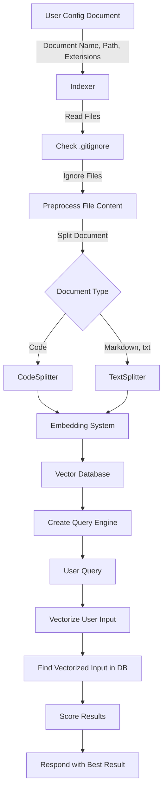

## Features

- Prompt template: https://jmp.sh/FXPzg65U
  - Custom system messages.
    - system messages can be used to instruct the model how to behave in a conversation, such as adopting a specific tone or following particular guidelines
    - Other types such as "user" and "assistant" are used for quick training of AI with some chat history
  - Custom Temperature: 
	- Temperature is a parameter that influences the creativity and randomness of the output. It is used when decoding the model's output probability distribution to sample the next token. GPT Temperature parameter ranges from 0 to 1
- Chat history: https://jmp.sh/3y5LYNN2
- Quick message template: https://jmp.sh/mvFixL88
- Custom OpenAI models: https://jmp.sh/KszlsWk3
- Prompt improvement shortcut: https://jmp.sh/sSh2nMCP
- Query private documents:
  - https://jmp.sh/nNkaAVbF
  - https://jmp.sh/YLRpWRXb

## Chat flow

## Private document index flow

- User config document name, path to document folder, document file extensions
- Indexer read all files with config document extensions in document folder
- Indexer ignore all file in .gitignore
- Indexer's preprocessing file content (analysis, summarization of code, etc.), and then Splitter splits the document into multiple paths depending on the document type (e.g., code uses CodeSplitter, markdown, txt uses TextSplitter).
- The Indexer sends split paths to the embedding system to vectorize text
- Store vectorized text in the Vector database
- Create a Query Engine per document
- When a user queries a private document
  - Query Engine vectorize user input
  - Query Engine find  vectorized user input from vector database
  - Query Engine scoring result
  - Query Engine responds with the best result by score

